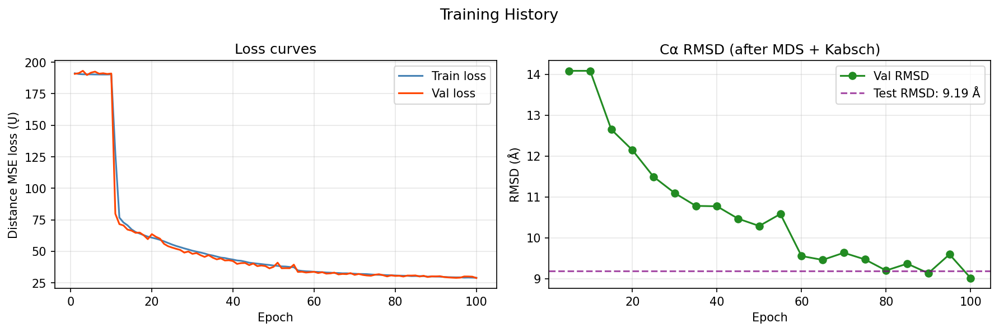
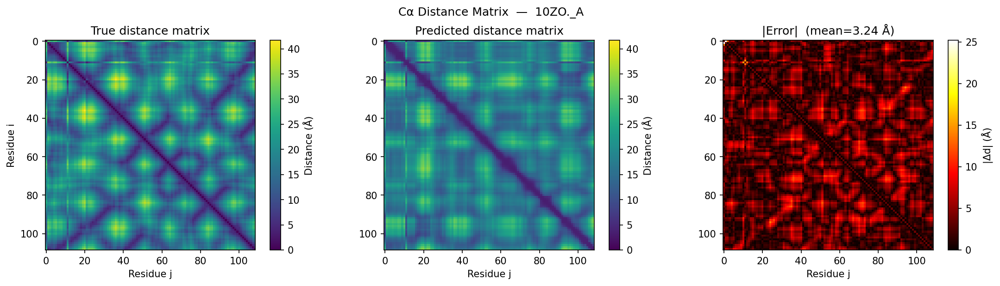

# 🧬 Protein Structure Prediction with Transformer + GNN


> **Coarse-grained Cα protein structure prediction from amino acid sequence alone,
> using a Transformer encoder + Graph Neural Network + Multidimensional Scaling pipeline.**
>
> *Sergi Cases Alonso & Martí Pascual Barluenga*


## Overview

This project addresses the **protein folding problem** at a coarse-grained level:
given only the amino acid sequence of a protein, can we predict its 3D structure?

We represent proteins as a sequence of **Cα (alpha-carbon) atoms**
and frame structure prediction as a **graph regression task**: predict the N×N pairwise
distance matrix between all Cα atoms, then reconstruct 3D coordinates via MDS.

Check out the poster and the report here:
- [Poster](documents/Poster_final.pdf)
- [Report](documents/Report_final.pdf)

## Pipeline

```
Input sequence:   Q  K  S  A  L  ···  V
                  │
                  ▼  embed + positional encoding
        ┌─────────────────────┐
        │  Transformer encoder │   ← long-range residue pairs
        │  4 layers · h=4 · d=256 │
        └─────────────────────┘
                  │  node embeddings h ∈ ℝ^256
                  ▼
        ┌─────────────────────┐
        │  GNN (chain graph)   │   ← local backbone geometry
        │  3 rounds · i±1 neighbours │
        └─────────────────────┘
                  │  updated embeddings
                  ▼
        ┌────────────────┐    ┌─────┐
        │ Distance MLP   │───▶│ MDS │   ← N×N dist matrix → ℝ³
        │ Softplus output │    └─────┘
        └────────────────┘
                  │  3D Cα coordinates X ∈ ℝ^(N×3)
                  ▼
        ┌─────────────────────┐
        │ Kabsch alignment     │   ← RMSD evaluation
        │ Test RMSD = 9.19 Å   │
        └─────────────────────┘
```

---

## Results

| Metric | Value |
|--------|-------|
| **Test RMSD** | **9.19 Å** |
| Test MSE loss | 28.86 Ų |
| Bond constraint loss | 0.10 Ų |
| Distance MAE (example protein) | 3.24 Å |
| RMSD (example protein, N=109) | 6.25 Å |
| Trainable parameters | 4,389,953 |

> 💡 For context: AlphaFold2 achieves <1 Å RMSD using MSA + evolutionary data.
> Sequence-only baselines typically range 8–20 Å. Our result is at the **lower end** of that range.

### Training curves

### Distance matrix prediction


### 3D structure comparison
![Structure]images/(10ZO._A_structure.png)

---

## Project Structure

```
.
├── parse_pdb.py        # Parse .pdb.gz files → sequences + Cα coordinates
├── dataset.py          # PyTorch Dataset, collate_fn, train/val/test split
├── model.py            # Transformer + GNN + MLP distance head
├── train.py            # Training loop, physics-informed loss, checkpointing
├── evaluate.py         # MDS reconstruction, Kabsch RMSD, plotting
├── utils.py            # Classical MDS, Kabsch algorithm, combined loss
├── main.py             # Entry point — run this to train
├── ablation.py         # Systematic ablation study
├── plot_ablation.py    # Generate ablation summary figures
├── requirements.txt    # Python dependencies
└── README.md
```

---

## Installation

```bash
# 1. Clone the repository
git clone https://github.com/sergicasesalonso/Graph-Neural-Networks-for-Protein-Structure-Prediction.git
cd Graph-Neural-Networks-for-Protein-Structure-Prediction

# 2. Install dependencies
pip install -r requirements.txt
```

**Requirements:**
```
torch>=2.0.0
numpy>=1.24.0
biopython>=1.81
tqdm>=4.65.0
matplotlib>=3.7.0
scikit-learn>=1.3.0
scipy>=1.11.0
```

---

## Usage

### Train the full model
```bash
python main.py
```

### Common options
```bash
# Quick test with 500 proteins
python main.py --max_samples 500

# Custom settings
python main.py \
  --pdb_dir ./pdb_files \
  --epochs 100 \
  --lr 1e-3 \
  --d_model 256 \
  --batch_size 4 \
  --device cuda

# If you get CUDA out-of-memory errors, reduce chunk_size:
python main.py --chunk_size 32
```

### Run the ablation study
```bash
python ablation.py --epochs 50 --max_samples 2000
```

### Generate ablation plots
```bash
python plot_ablation.py
```

---

## Dataset

Proteins were downloaded from the [RCSB Protein Data Bank](https://www.rcsb.org/) using
the following filters:

| Filter | Value |
|--------|-------|
| Experimental method | X-ray diffraction |
| Resolution | ≤ 2.0 Å |
| R-free | ≤ 0.25 |
| Sequence length | 50–500 residues |
| Polymer entity count | 1 (single chain) |
| **Total chains** | **15,718** |

The dataset is split **80% train / 10% val / 10% test** (12,574 / 1,571 / 1,573 chains).

> ⚠️ The raw `.pdb.gz` files are **not included** in this repository (too large).
> Download instructions: [RCSB Batch Download](https://www.rcsb.org/docs/programmatic-access/batch-downloads-with-shell-script)
> 
> A pre-processed cache of the dataset (`.pkl`) is available at:
> [Google Drive link](https://drive.google.com/file/d/1feQnZgWO20u0BhXp2TxlxfBDBEphce6F/view?usp=drive_link)


## References

1. W. Ding and H. Gong, *Predicting the real-valued inter-residue distances for proteins*, Advanced Science (2020)
2. T. Wu et al., *DeepDist: real-value inter-residue distance prediction*, BMC Bioinformatics (2021)
3. J. Jumper et al., *Highly accurate protein structure prediction with AlphaFold*, Nature (2021)
4. T.N. Kipf and M. Welling, *Semi-supervised classification with graph convolutional networks*, ICLR (2017)
5. F. Morcos et al., *Direct-coupling analysis of residue co-evolution*, PNAS (2011)
6. A. Vaswani et al., *Attention is all you need*, NeurIPS (2017)
7. Z. Lin et al., *Evolutionary-scale prediction of atomic-level protein structure with a language model*, Science (2023)


